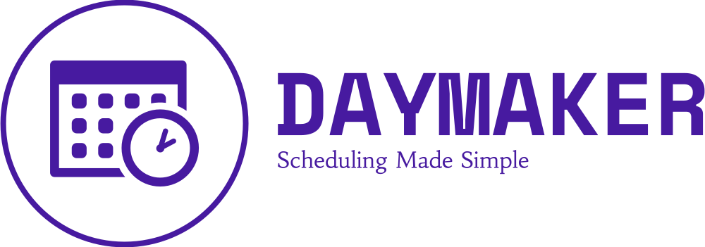

<h1>Welcome to <a href="https://www.day-maker.ca" target="_blank">DayMaker</a>: Unleash Your Productivity Potential!</h1>
<h2>Effortlessly organize your schedule, supercharge your productivity, and reclaim control of your day</h2> 
 
<h3>Introduction</h3> 

Daymaker is a powerful web application designed to help you streamline your daily tasks and schedules. With Daymaker, you can create reusable actions, templates, and schedules, making it easier than ever to stay organized and maximize your productivity. This README provides essential information about Daymaker, its features, and the technologies used to build it.

 
<h3>Getting Started</h3> 

To get started with Daymaker, follow these simple steps:
 

1. Create Reusable Actions: Start by defining actions that you frequently perform. These actions can be assigned to tasks, making it easy to add them to your schedules.

2. Create Templates: Build templates that encapsulate your recurring schedules and tasks. You can add tasks to templates using your reusable actions.

3. Create Schedules: Schedule your day by selecting a date and adding a template. Daymaker will help you stay on track by organizing your tasks automatically.

 
<h3>Important Notes</h3> 

- Demo Route: Explore Daymaker's features without logging in on the Demo Route. Note that the Demo Route doesn't save any data to the database and uses default data provided by the application. Refreshing the page on the Demo Route will reset all initial data and remove locally made changes.

- Action and Template Deletion: Be cautious when deleting actions or templates, as this will also remove associated tasks and schedules.

 
<h3>Additional Notes</h3> 

- Custom UI Components: Daymaker uses custom-built UI components, minimizing third-party dependencies and ensuring a smooth user experience.

 
<h3>Technologies Used</h3> 

Daymaker is built using a modern tech stack, ensuring a seamless and secure experience:

- Frontend: React.js, HTML, CSS, JavaScript, TypeScript
- Backend:  NextAuth.js, Prisma, PostgreSQL, Node.js
- Full-Stack: Next.js
- Styling: Tailwind CSS
- Authentication: Google Authentication

 
<h3>Application Accessibility</h3> 

Daymaker is fully responsive and optimized for all viewports. Whether you're on a desktop, tablet, or mobile device, you can access Daymaker and manage your schedule effortlessly.

 
<h3> Explore Daymaker</h3>

Ready to experience the benefits of Daymaker? Visit our website at <a href="https://www.day-maker.ca" target="_blank">day-maker.ca</a> to get started.
 
